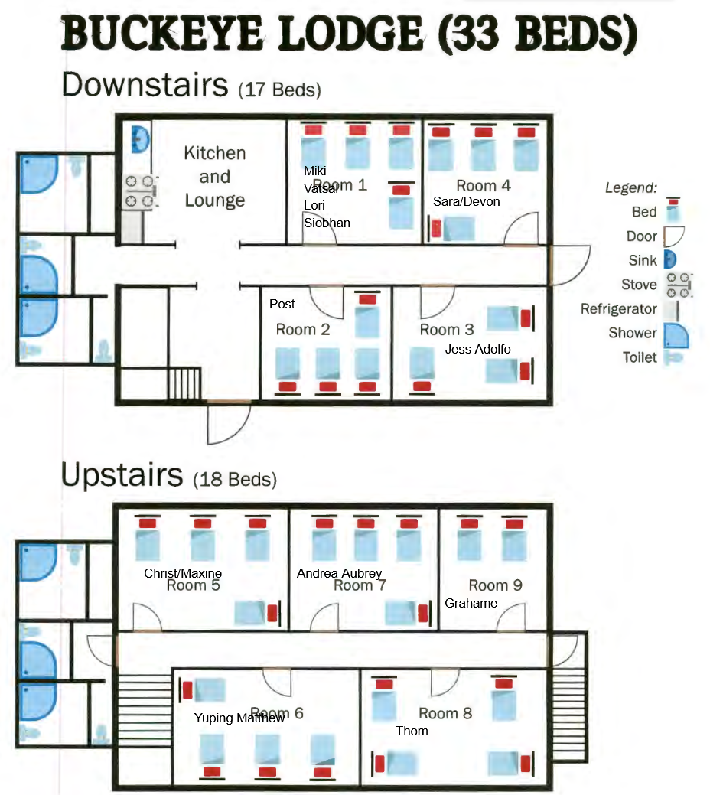
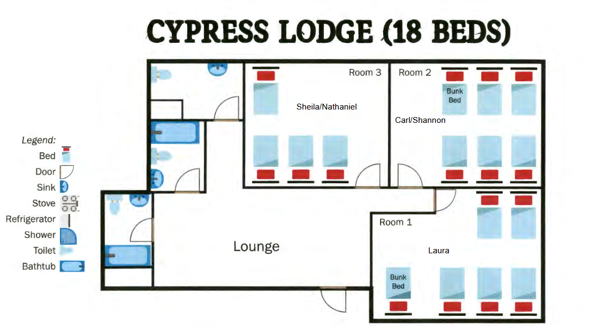
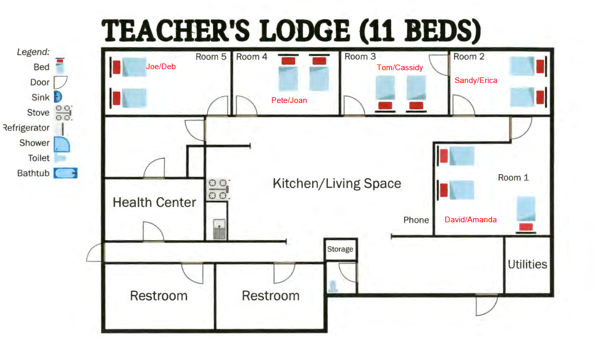
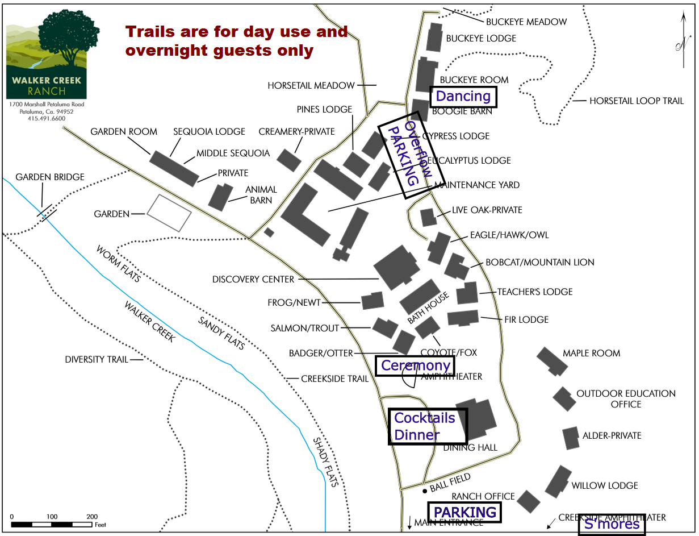

# Phil and Kathryn's Website!

# [RSVP HERE](https://docs.google.com/forms/d/e/1FAIpQLSdb4hoWW1RRWFUf0m6yEEGGmeJv6fUi9wsexoM-h6kjG1RO1Q/viewform?usp=header)

# Photos
[Photos of Phil and/or Kathryn you feel like sharing](https://drive.google.com/drive/folders/1PeZt1Mxu6AgiRc7WDFCbZzBjKT45-65y?usp=sharing)

[We'd also like to compile photos from the good times at Casita Calaveras](https://drive.google.com/drive/folders/1X58aDVo3VKQTLNU9pvx_qz4HXxf5xbIQ?usp=sharing)

# Theme
Hydrate or diedrate. There will be lots of outdoor fun so bring a water bottle and sunscreen. Also, there is limited cell-service in rural Marin County, so get your maps figured out in town first.

# Agenda

## Friday
### Arrival at Walker Creek
People can show up at 1pm and rooms should be open by 2. There is not a formal check-in process. The WiFi password is: Wireless!

### Beach Details
The beach is [Dillon Beach](https://maps.app.goo.gl/bKMWqBuhHTdom12Q8) on the north side of Tomales Bay. Parking lot is $15/car with maybe street parking in the nearby town. We will supply coolers of some seltzer and water, light snacks, sunscreen, and some games. Kathryn and Phil will aim to be there from 2-4 pm. In early October it can be warm and calm or cool and windy so be sure to check the weather before and plan appropriately.

### Welcome Dinner
Dinner will be served at (TBD), followed by a campfire and s'mores. Phil and Kathryn should show up by 8:30 for hanging out. We will provide s'more fixings. 

### Room Assignments
As of 9/1 we've been able to accomodate first-choices. See map below for guidance. Feel free to negotiate swaps amongst yourselves. There are bathrooms in each Lodge/bunkhouse and the building labelled bathhouse on the map also has extra showers and bathrooms if needed

* 
* 
* 
* 

#### Bunkhouse
Ellis, Leah, James, Joe, Kayla

Totally up for grabs except Badger/Otter and Coyote/Fox

#### Camping
Madzilla, Dillon

Wherever, but reccomend around horsetail meadow.

## Saturday
Hangout at the ranch including swimming, wiffle ball, and general amusement.
Afternoon / Evening is ceremony, cocktail hour, Paella dinner, and dancing

### Wedding Timeline
 * 4:00: Ceremony starts, sharp
 * 4:30: Cocktail hour
 * 6:00: Begin Dinner
 * 8:00: Dancing in the barn. Music provided by the ten-piece Jay Middleton Party Band.
 * Pie cutting will be at the first musician break
 * There is not curfew and the barn has a sound system for after the musician go home

## Sunday
Brunch and packing up

# Overview

## Who:
Family and friends of Phil Jahelka and Kathryn Plant.
## What:
Phil and Kathryn's Wedding
## When:
October 4th
## Where:
Walker Creek Ranch Outside Petaluma, CA.
## Why:
Because Kathryn and Phil feel like throwing a big party to celebrate our relationship.

# Additional Info:
Walker Creek Ranch as limited cell service, and getting an Uber may be impossible. They do have WiFi, password is 

# WCR Map

# Registry
No gifts are expected, your presence is enough! However, since some folks have asked about it, if you'd like to gift us something, registry links are below.
* [Kitchen Gear](https://www.williams-sonoma.com/registry/lt8wgntmqv/registry-list.html)
* [Books](https://bookshop.org/wishlists/efdc484b9d6b44745d9da3d9f28e843d47450618)
* If you'd prefer to donate to our honeymoon fund, you can Venmo Phil (@Phillip-Jahelka).

I'm hosted with GitHub Pages!

# TODO

